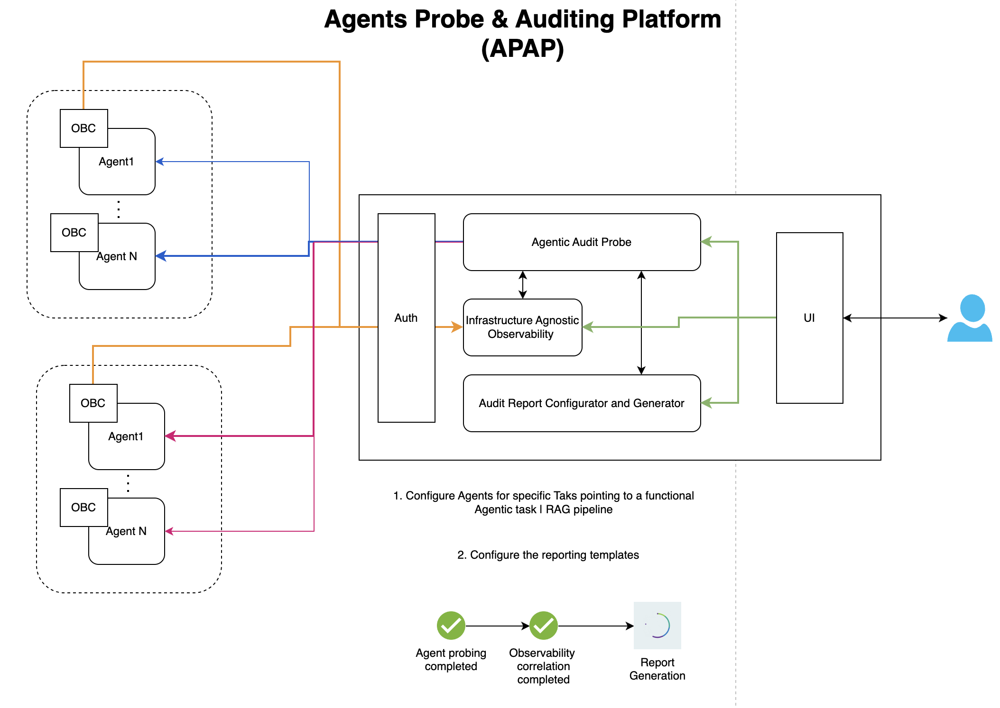

# Agent Probe and Auditing Platform
The Agents and RAG Auditing Platform (APAP) architecture is designed to probe and audit agentic systems across different enterprises or organizations (Org-1, Org-2) while ensuring infrastructure-agnostic operation. It facilitates the auditing and observability of these external agents from a variety of security and operational perspectives.

The agentic infrastructure layer comprises operational building components (OBCs) from various organizations. Each OBC contains agents (Agent 1 through Agent N) that operate independently within their respective organizational ecosystems. These agents are external to the APAP platform and are configured by their respective organizations to execute specific tasks, such as functional workflows or RAG (Retrieval-Augmented Generation) pipelines. The platform interacts with these agents remotely, enabling the probing and auditing process without requiring direct control or ownership of the agents.

The auditing platform serves as the central processing hub and is composed of several interconnected modules. The "Auth" module manages secure authentication and communication with agents across different organizational boundaries. The "Agentic Audit Probe" module establishes connections with these external agents to perform probing tasks and collect relevant data. The data is then processed by the "Infrastructure Agnostic Observability" component, which normalizes and correlates telemetry from diverse organizational infrastructures. The resulting insights are fed into the "Audit Report Configurator and Generator," where customizable templates enable the generation of detailed security and operational audit reports. This modular design ensures flexibility, scalability, and compatibility with diverse organizational systems.

The user interface (UI) provides an intuitive portal for end-users to configure the auditing process, define reporting templates, and review audit outcomes. Through the UI, users can configure probing tasks for specific agents, correlate observability data, and generate reports, providing a comprehensive overview of the security and operational performance of agents across organizations. The status of the process is transparently displayed with steps such as "Agent Probing Completed," "Observability Correlation Completed," and "Report Generation."

This architecture empowers organizations to audit and observe external agentic systems securely and effectively, ensuring compliance and operational reliability without direct dependency on or control over the agents themselves.

